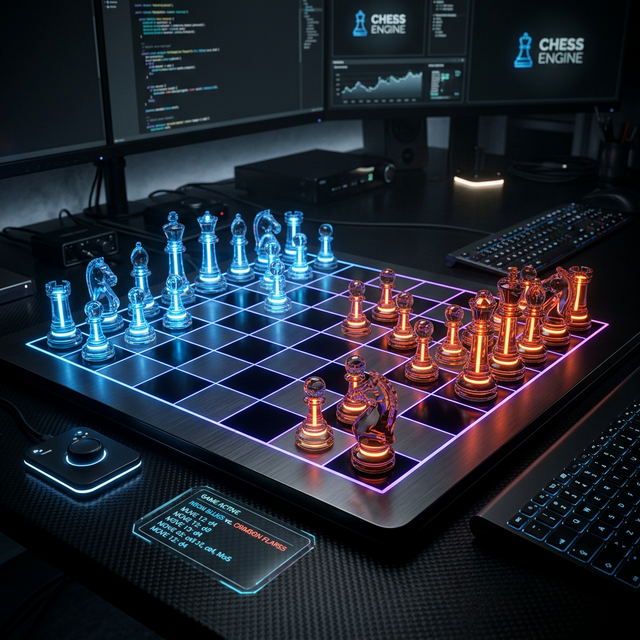

# ♛ Fatima Chess Board

A premium, world-class chess platform built with native web technologies. Fatima Chess combines high-fidelity graphics, a sophisticated AI engine, and a fluid user experience.

## ✨ Key Features

- **🧠 Advanced AI Engine**: Powered by a Minimax algorithm with Alpha-Beta pruning and Quiescence search. The AI runs in a dedicated Web Worker to ensure zero UI lag during deep calculations.
- **🎨 Premium Visuals**: High-DPI Canvas rendering with device-pixel-ratio scaling for razor-sharp graphics. Includes particle effects for captures and smooth cubic-bezier animations for piece movement.
- **🌈 Dynamic Themes**: Choose from curated themes like *Marble*, *Cyber*, *Forest*, and *Ocean*, each with custom board and piece colors.
- **⏱ Platform Integration**: Features dual chess clocks with customizable time controls and increments, full PGN export functionality, and responsive mobile support.
- **🛠️ Robust Engine**: Implements the full suite of international chess rules, including castling, en passant, promotion, and sophisticated draw detection (Stalemate, Threefold Repetition, 50-move rule).

## 🚀 Getting Started

No installation required. Fatima Chess is a pure client-side application.

1. Clone the repository.
2. Open `index.html` in any modern web browser.

## 🛠 Built With

- **Core**: Vanilla JavaScript (ES Module architecture)
- **UI**: Modern CSS Design System (Glassmorphism, CSS Custom Properties)
- **Graphics**: HTML5 Canvas (HDPI)
- **AI**: Minimax + Alpha-Beta Pruning

